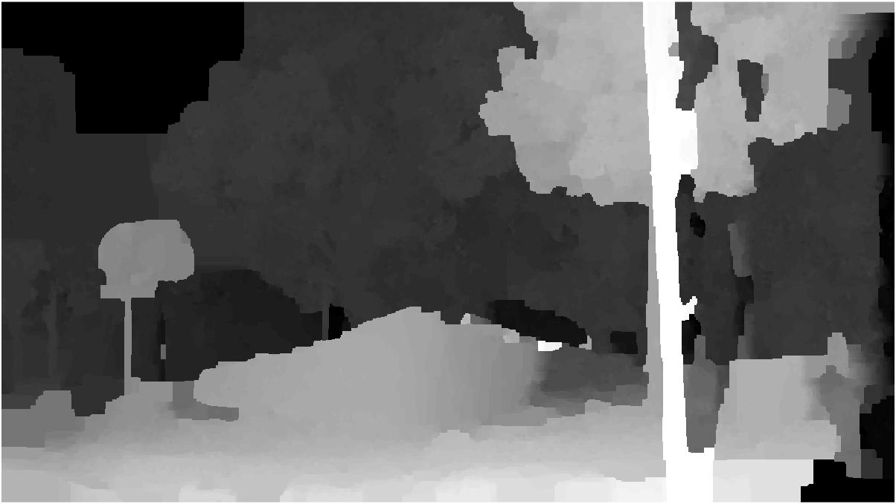

#### Input data:
im3_left and im3_right

#### Run:
just run part_3.m

#### Files

**search_line.m :** 
    Find the epipolar line and do validation
**pairwise_structure.m :**
    Build the pairwise matrix to generate the structure(location of neighbors)
    of the image
**label_prior.m:**
    Build the labelcost matrix for prior term
**data_term.m:**
    Build the unary matrix for data term

#### Output
depth_map.jpg
