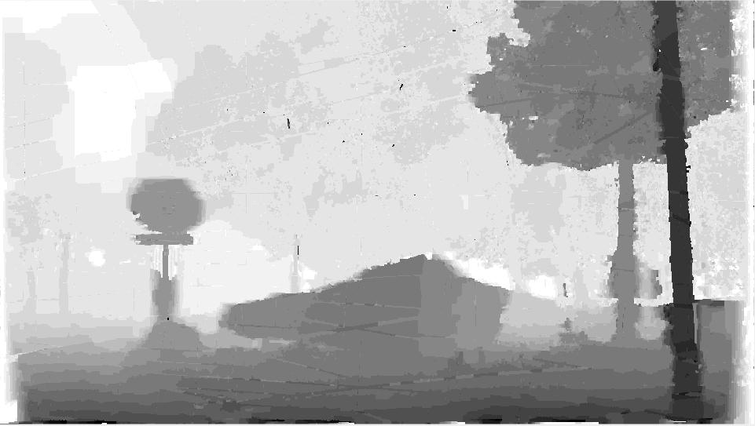
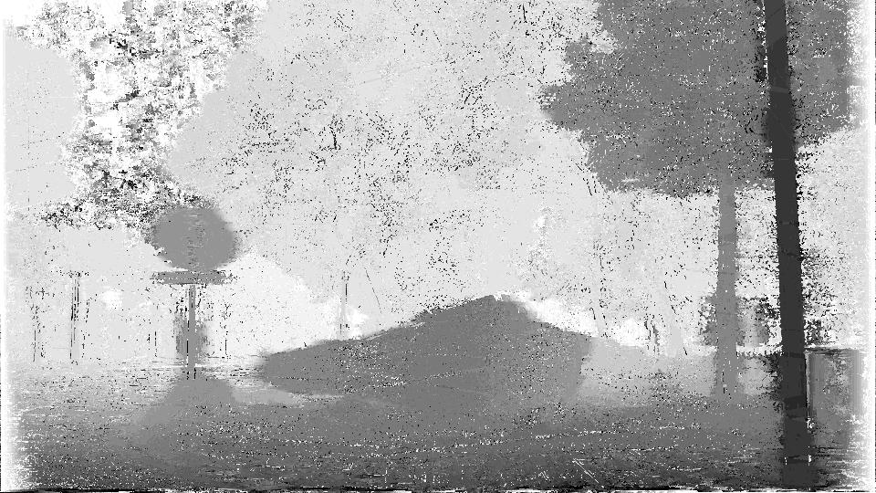

#### Input data:
**video_image.mat:**
    road video sequence for each frame from the file Road
**cameras.mat:**
    camera calibration matrix (K R T)

#### Run:
just run part_4.m

#### Files
**Read_video_images.m:**
    convert video frames to digital matrix and stored as video_image.mat
**read_cameras.m:**
    get camera matrix and stored as cameras.mat
**search_line.m :**
    Find the epipolar line and validation
**pairwise_structure.m :**
    Build the pairwise matrix to give the structure(location of neighbors)
    of the image
**label_prior.m:**
    Build the labelcost matrix for prior term
**data_term5.m:**
    Build the unary matrix for data term using multiple frames

just ignore the data_term.m and data_term3.m which are the previous verstion
to compute the unary and data term.

#### Output
**15best.jpg:**
    the best depth map for the 15th iamge of the road video.

**depth_map_before_GC.jpg:**
    temporary depth map before graphcut for checking wether the data term is right

**depth:**
    some previous stored depth map which are not good enough
    from some previous program version.